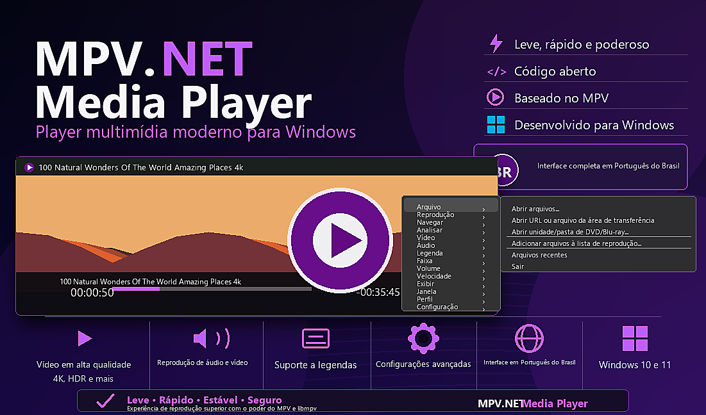
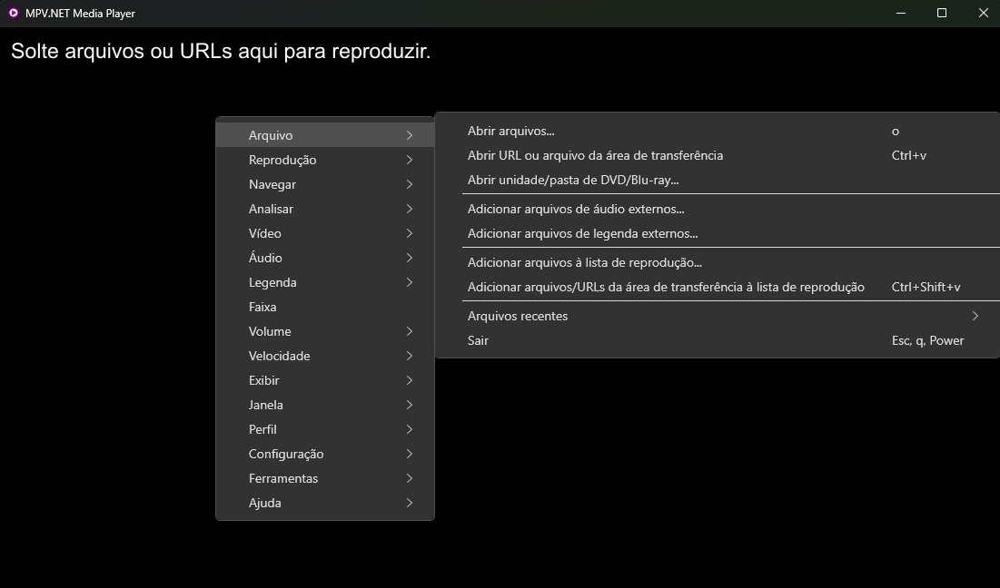
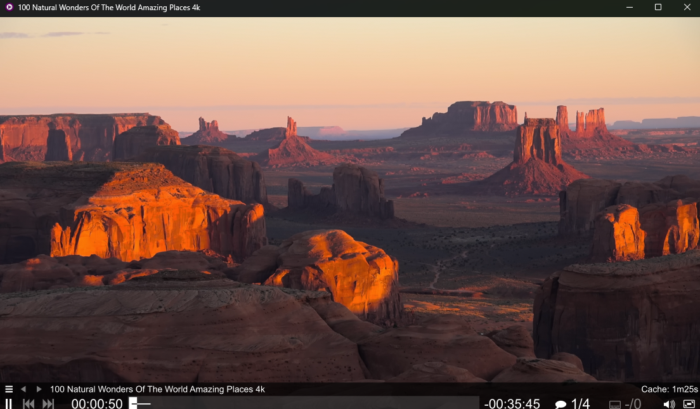

# MPV.NET Media Player

Fork de manutenção do **MPV.NET Media Player** para Windows, baseado no mpv.net e focado em compatibilidade com mpv/libmpv, documentação objetiva e mudanças pequenas e verificadas.

## Prioridades

- manter o comportamento existente;
- preservar compatibilidade com arquivos de configuração e comandos do mpv;
- documentar uso, configuração, build e release do fork;
- corrigir bugs pequenos sem refatorações amplas;
- manter a manutenção do repositório simples e rastreável.

## Documentação principal

- [Manual](docs/manual.md)
- [Microsoft Store](https://apps.microsoft.com/detail/9N441SP6XHLD)
- [Configuração](docs/CONFIGURACAO.md)
- [Guia operacional](docs/guia-operacional.md)
- [Logs de diagnóstico](docs/logging.md)
- [Atalhos](docs/ATALHOS.md)
- [Arquitetura técnica](docs/developer/architecture.md)
- [Relatório técnico inicial](docs/developer/architecture.md#relatorio-tecnico-inicial-2026-06-12)
- [Configuração técnica](docs/developer/configuration.md)
- [Integração com mpv/libmpv](docs/developer/mpv-integration.md)
- [Interface Windows](docs/developer/windows-ui.md)
- [Build e release](docs/developer/build-release.md)
- [Localização](docs/developer/localization.md)
- [Artefatos de IA](.ai/README.md)

## Uso rápido

```powershell
mpvnet.exe "C:\Videos\filme.mp4"
mpvnet.exe "C:\Listas\iptv.m3u"
mpvnet.exe "https://example.com/live/index.m3u8"
```

O mpv.net aceita arquivos locais, playlists e URLs de streaming compatíveis com o mpv.

## Apresentação do player

O MPV.NET Media Player também está disponível na Microsoft Store:

- Link profundo: `ms-windows-store://pdp/?productid=9N441SP6XHLD`
- URL da Web Store: [https://apps.microsoft.com/detail/9N441SP6XHLD](https://apps.microsoft.com/detail/9N441SP6XHLD)







## Doacao

Se quiser apoiar o projeto, use este link:

- Stripe: [https://donate.stripe.com/bJedRa0Fd21G4hg5OneIw00](https://donate.stripe.com/bJedRa0Fd21G4hg5OneIw00)

Na tela "Sobre" do aplicativo, o link Stripe aparece acima da area do Pix.
